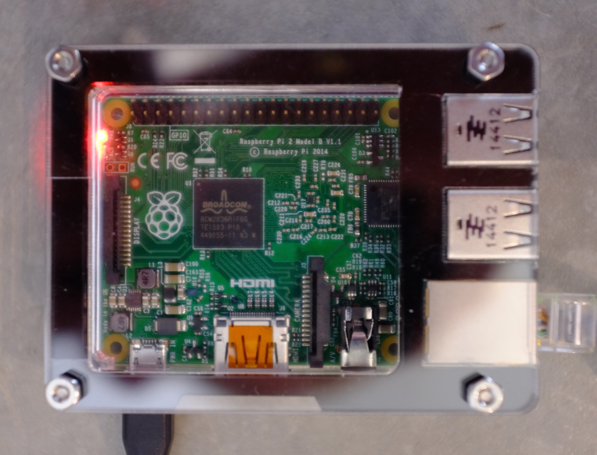
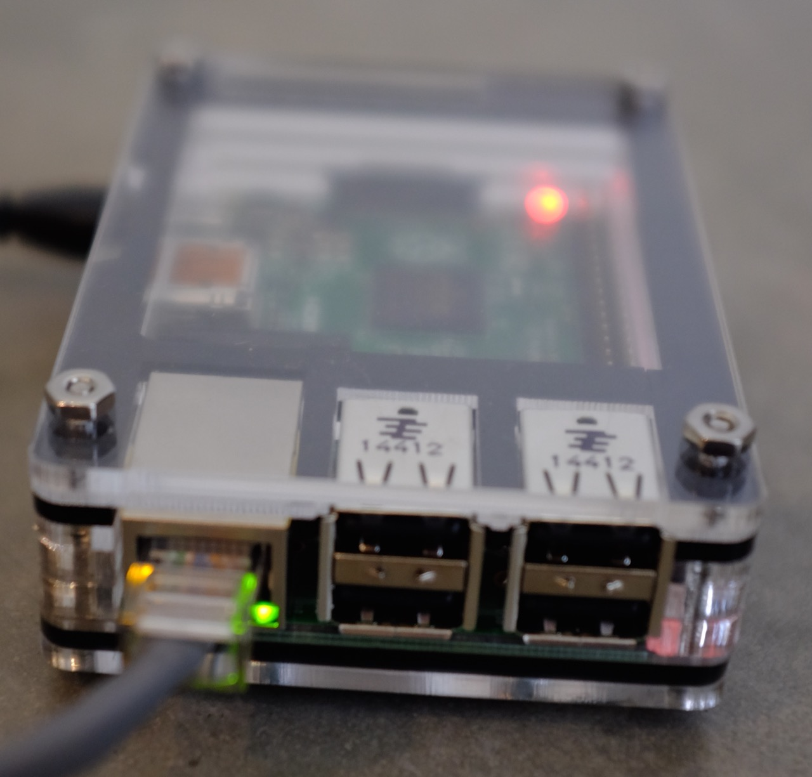
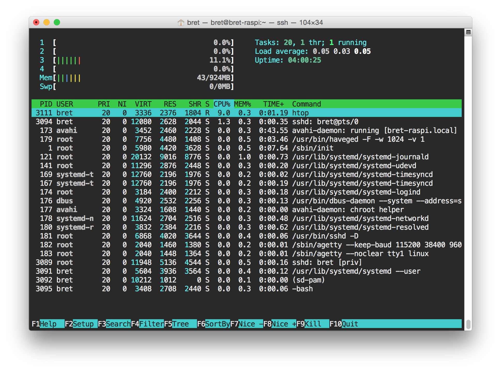

# Raspberry Pi Arch Linux ARM Bootstrap




*Featuruing C4 Labs [Zebra Bold](http://www.amazon.com/Zebra-Bold-case-Raspberry-Black/dp/B00UFEBYNS) Case*

Intro readings:

- [Raspi Quickstart Guide](http://raspberrypi.org/qsg)
- [Arch Linux ARM: Raspberry Pi 2](http://archlinuxarm.org/platforms/armv7/broadcom/raspberry-pi-2)
- [Arch Linux Installation Guide](https://wiki.archlinux.org/index.php/Installation_guide)
- [Arch Linux General Recommendations](https://wiki.archlinux.org/index.php/General_recommendations)
- [`systemd` basics](https://wiki.archlinux.org/index.php/Systemd#Basic_systemctl_usage)

Arch is a difficult OS for beginners because it requires a fairly comprehensive understanding of how Linux systems are put together.

This repo provides sane base configuration and a collection of optional roles approrpirate for a raspi2.


## For new SD Cards

New SD cards need to be formatted a special way.  Use [sdformatter](https://www.sdcard.org/downloads/formatter_4/)

- `brew cask info sdformatter`
- `brew cask install sdformatter` (requires sudo)

Select `Overwrite Format`.  This takes about 10 mins for a 32Gb flash drive.  Only need to do this once.

## Installing Arch the hard way

...Or at least way that I had to do it.

Requirements:

- 2 USB sticks
- A macbook pro with an SD card reader.
- A second laptop for reference
- Magnifying glass if you have a retina mac


**Step 1**

Download the arch install media.  We are using it to live boot so that we can partition the SD card correctly.

- [Archlinux Mirrors](https://www.archlinux.org/download/)

The file will have a name like: `archlinux-2015.06.01-dual.iso`

**Step 2**

Follow the Arch Wiki instructions on getting this onto one of your USB drives.

- [Arch USB Media Howto OS X](https://wiki.archlinux.org/index.php/USB_flash_installation_media#In_Mac_OS_X)

**Step 3**

Restart your computer, and hold down `Option` while it reboots.  Select the USB stick to boot from.

**Step 4**

Run `lsblk` to list all your connected devices.  Insert the SD card and run `lsblk` again.  Notice what was added.  This is the SD card.  It should be something like `/dev/sdb`.

**Step 5**

Follow the partitioning instructions on the Arch ARM website:

- [Rasberry Pi](http://archlinuxarm.org/platforms/armv7/broadcom/raspberry-pi-2)

Its unlikely you will be able to get the wifi or ethernet drivers working in the arch live boot.  This requires the Internet to which your system does not have access too.  Just download the Arch install archive to a second thumbdrive on a different computer, and move it over to the live boot and continue the directions.

Arch should now be read to go on the SD card and should boot fine.

## Installing Arch the easy way

Requirements:

- USB SD Card Reader

Use vagrant + virtual box + a 3rd party USB SD card reader. This way you can `vagrant up` a linux VM, mount the 3rd part USB SD card reader as a USB device and simply follow the standard directions.  3rd party SD card readers should be able to mount inside Guest Machines.

## Pre-playbook considerations

- install `etckeeper` and `init` it.
- [Arch Wiki: Etckeeper](https://wiki.archlinux.org/index.php/Etckeeper)

As root:

```sh
$ pacman -S etckeeper
$ cd /etc
$ etckeeper init
$ git add -A ; git commit -m 'Initial commit'
```

Useful for keeping track of changes

## Ansible pitfalls

- Homebrew's ansible cant connect to a remote Arch system using `--ask-pass`.

```js
{'msg': 'FAILED: Incompatible ssh peer (no acceptable kex algorithm)', 'failed': True}
```

> guess there is no specific version, you might have bigger issue with newer openssh and very old `paramiko` not having cyphers in common

> openssh might not be as happy with older versions which ansible might tolerate -- @bcoca

- Ansible is is a `python2` program.  Use `pip2` to install it.  This method provides a `paramiko` that is able to connect to the newer Arch Openssh.

- Arch does not have a `python` in its default path.  Arch installs python2 as `python2` and python3 as `python`/`python3`.  Ansible is dumb this this and doesn't look for a `python2`:  [#how-do-i-handle-python-pathing-not-having-a-python-2-x-in-usr-bin-python-on-a-remote-machine](http://docs.ansible.com/faq.html#how-do-i-handle-python-pathing-not-having-a-python-2-x-in-usr-bin-python-on-a-remote-machine) Add to ansible your hosts file:

```ini
ansible_python_interpreter=/usr/bin/python2
```

- Ansible's hostname module doesn't work with arch.  Its a bug.  Float this patch: [8679.patch](https://github.com/ansible/ansible/pull/8679.patch) as of Ansible 1.9.1.  Should be fixed in the next ansible release.

```sh
$ cd /usr/local/lib/python2.7/site-packages/ansible
$ wget https://github.com/ansible/ansible/pull/8679.patch
$ patch -p3 < 8679.patch
```

## Setting up the play

There has to be a better way to do this.

Edit `vars.yml` with the following values:

- `root_pass`: Generate a big long random password and then crypt it.  Put the crypted value here. See [#how-do-i-generate-crypted-passwords-for-the-user-module](http://docs.ansible.com/faq.html#how-do-i-generate-crypted-passwords-for-the-user-module)  Read more about the password field for the [user module](http://docs.ansible.com/user_module.html).

```sh
$ pip2 install passlib
$ python -c "from passlib.hash import sha512_crypt; import getpass; print sha512_crypt.encrypt(getpass.getpass())"
# a prompt will ask you for a password and output a crypted copy
```

- `timezone`: Set the timezone of your system. TODO: Enable auto timezone based on GeoIP.

```sh
$ timedatectl list-timezones
# List the correct name of the available timezones
```

- `hostname`: sets the hostname of your device.
- `admin_name`: set the name of the primary 'admin' user.  This is going to be the first user that gets sudo and manages the system.
- `admin_pass`: Set the password of the admin user.  This needs to be crypted.
- `admin_keys`: a URL to the admins github public keys.


## What this playbook does

- Bootstrap python2 onto the system.
- Set timezone
  (Time is network syncted by default using [Systemd-timesyncd](https://wiki.archlinux.org/index.php/Systemd-timesyncd))
- Set locale to en_US.UTF-8
- Set the hostname
- Create the primary admin account
- Install sudo ([Arch Wiki: Sudo](https://wiki.archlinux.org/index.php/Sudo))
- Set up the [`wheel`](https://en.wikipedia.org/wiki/Wheel_(Unix_term)) group
- Install admins github public keys ([`authorized_keys` module](http://docs.ansible.com/authorized_key_module.html))
- Install zeroconf networking and .local resolution via [avahi](https://wiki.archlinux.org/index.php/Avahi)
- Reconnect as the new admin user
- Change the `root` password
- disable root `ssh` access ([ssh #Deny](https://wiki.archlinux.org/index.php/Secure_Shell#Deny))
- disable password `ssh` logins ([SSH_keys#Disabling_password_logins](https://wiki.archlinux.org/index.php/SSH_keys#Disabling_password_logins))



*Ahh.. a sight to be seen*

## General System Maintenance

- [System_maintenance](https://wiki.archlinux.org/index.php/System_maintenance)
- [Pacman#Upgrading_packages](https://wiki.archlinux.org/index.php/Pacman#Upgrading_packages)

```sh
# Full update everything \o/
$ pacman -Syu
```

## References:

- [5minbootstrap](https://github.com/phred/5minbootstrap/blob/master/bootstrap.yml)
- [phred/5minbootstrap](https://github.com/phred/5minbootstrap)
- [My First 5 Minutes On A Server; Or, Essential Security for Linux Servers](http://plusbryan.com/my-first-5-minutes-on-a-server-or-essential-security-for-linux-servers)
- [My First 5 Minutes on a Server (with Ansible)](http://practicalops.com/my-first-5-minutes-on-a-server-with-ansible.html)
- [Ansible Docs](http://docs.ansible.com/playbooks.html)
- [Ansible Pacman Module](http://docs.ansible.com/pacman_module.html)
- [Ansible Yaml Docs](http://docs.ansible.com/YAMLSyntax.html)
- [Ansible lineinfile module](http://docs.ansible.com/lineinfile_module.html)
- [YAML ansible-examples.yml](https://gist.github.com/bcomnes/668938bbacd8f3623957)
- [Arch Time Sync](https://wiki.archlinux.org/index.php/Time#Time_synchronization)
- [How to Read the Arch Wiki](https://wiki.archlinux.org/index.php/Help:Reading)
